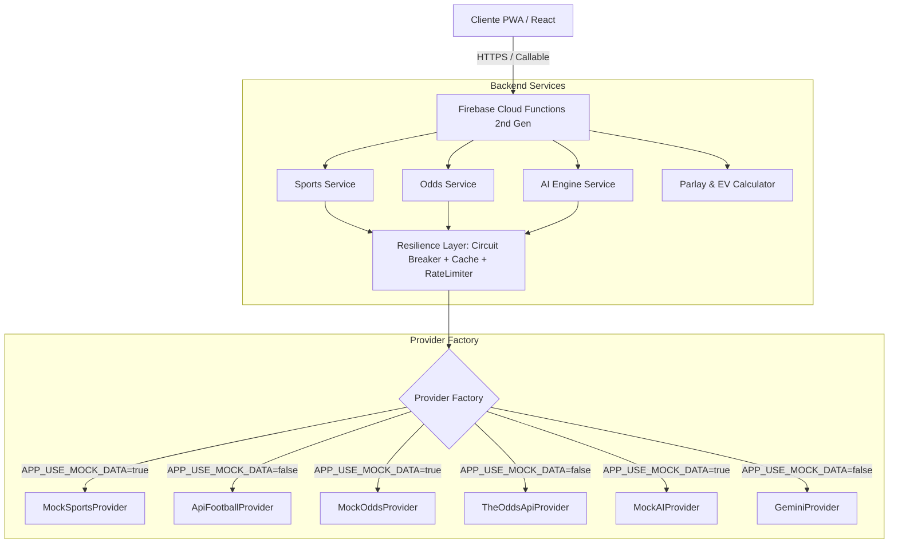

# Arquitectura del Sistema - Bet Analyzer Pro

Este documento describe la arquitectura global, patrones de diseño y principios de resiliencia implementados en **Bet Analyzer Pro**.

---

## 1. Visión General de la Arquitectura

Bet Analyzer Pro está concebida bajo una **arquitectura por dominios (Domain-Driven Design simplificado)** con desacoplamiento total entre frontend y proveedores de datos externos.

---

## 2. Principios Arquitectónicos Fundamentales

### A. Inversión de Dependencias (Dependency Inversion)
Los servicios de negocio (`SportsService`, `OddsService`, `AIService`) interactúan exclusivamente con **interfaces abstractas** (`SportsDataProvider`, `OddsProvider`, `AIProvider`). Ninguna clase del núcleo conoce detalles de HTTP, librerías SDK o APIs propietarias.

### B. Modo Mock Desacoplado
A través de la variable `APP_USE_MOCK_DATA=true` (backend) y `VITE_APP_USE_MOCK_DATA=true` (frontend), la aplicación conmuta a proveedores simulados que retornan fixtures realistas y cuantitativamente calibrados:
- Se evita el gasto innecesario de cuota en APIs de terceros durante el desarrollo y testing.
- Cada objeto retornado incluye el metadato `{ isMock: true }` y la UI muestra un banner indicativo.

### C. Patrón Circuit Breaker
Para evitar la degradación en cascada cuando un proveedor externo sufre interrupciones o latencias extremas:
1. **CLOSED:** Operación normal. Las peticiones se cursan al proveedor.
2. **OPEN:** Tras alcanzar el umbral de fallos consecutivos (`failureThreshold`), el circuito se abre inmediatamente devolviendo un error controlado o respuesta en cache sin sobrecargar al proveedor.
3. **HALF_OPEN:** Pasado el tiempo de enfriamiento (`recoveryTimeMs`), se permite una solicitud de prueba. Si prospera, el circuito vuelve a cerrarse; si falla, se mantiene abierto.

### D. Estrategia de Caching con TTL
Implementada mediante `CacheService` en memoria con desalojo automático periódico:
- **Partidos:** TTL de 120 segundos.
- **Cuotas en Vivo:** TTL de 60 segundos.
- **Análisis de IA:** TTL de 1800 segundos (30 minutos).

### E. Rate Limiting por Ventana Deslizante
Para respetar los límites de tarifa de las APIs contratadas (ej. 60 req/min), el backend evalúa cada llamada contra un buffer temporal circular, respondiendo con `429 Too Many Requests` de forma preventiva.

---

## 3. Arquitectura por Dominios (Frontend)

El directorio `src/features/` agrupa lógica, estado, componentes y servicios por dominio de negocio:
- **`auth/`:** Sesión multiusuario, Firebase Auth y usuario de demostración.
- **`dashboard/`:** Agregación de KPIs, partidos en vivo y oportunidades de valor del día.
- **`matches/`:** Explorador de partidos con filtros por liga, estado y visualización H2H.
- **`analysis/`:** Laboratorio de cálculo cuantitativo de xG, Poisson y Valor Esperado.
- **`parlays/`:** Constructor de boletos combinados con cálculo de cuota conjunta y alertas de correlación.
- **`bookmakers/`:** Comparador de márgenes porcentuales y payout por casa de apuestas.
- **`history/`:** Auditoría de apuestas con cálculo de Yield, ROI y win rate.
- **`settings/`:** Preferencias de usuario (cuotas decimales, americanas, fraccionales) e inspección de modo mock.
